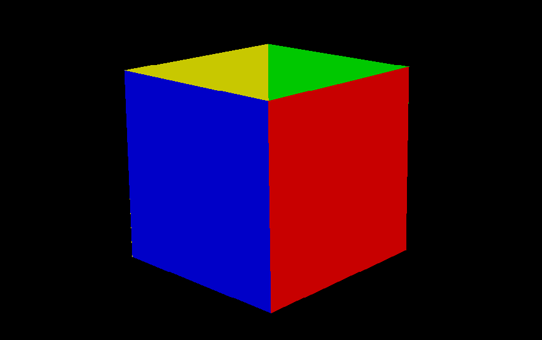

# 3D Renderer from scratch

### Установка

#### Linux
Нам потребуется CMake.

Для работы SFML потребуются дополнительные зависимости. Подробнее можно прочитать [здесь](https://www.sfml-dev.org/tutorials/2.5/compile-with-cmake.php) и [тут](https://www.sfml-dev.org/tutorials/2.5/start-linux.php).

Если не хочется возиться с зависимостями, то можно попробовать 
`sudo apt-get install libsfml-dev`, который подтянет всё что нужно, а затем уже компилить рендерер.

Для того чтобы скомпилить тестовое приложение, прописываем в корне проекта следующее:
```
cmake .
cmake --build .
```

#### Windows

По идее всё так же, только к SFML не потребуется подтягивать зависимости. Но это неточно.

#### macOS

Туман войны.

### Примеры работы



